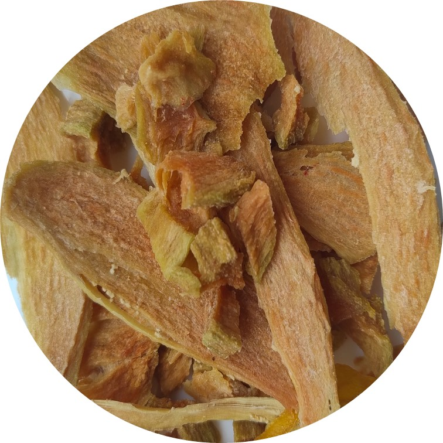
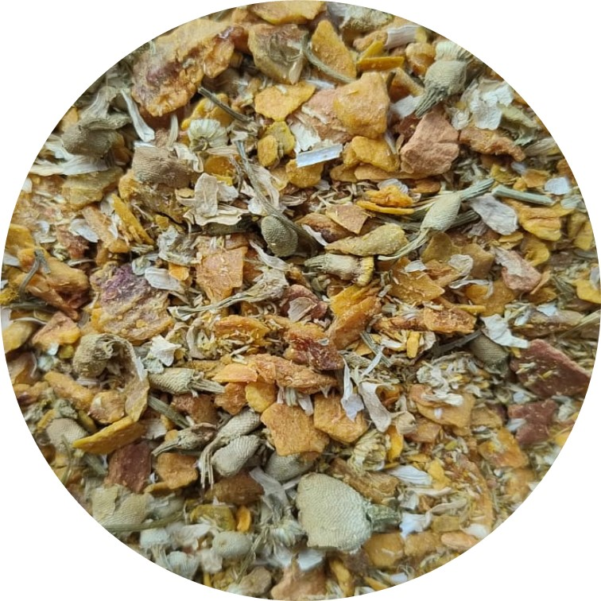

```{=html}
<style>
.quarto-title-block .subtitle {
  text-align: center;
}
</style>

<style>
.carousel-container {
  position: relative;
}

.carousel {
  display: flex;
  overflow-x: auto;
  gap: 16px;
  scroll-behavior: smooth;
}

.card {
  flex: 0 0 250px;
}

.card img {
  width: 100%;
  height: 180px;        
  object-fit: cover;   
  border-radius: 10px;  
}

button {
  position: absolute;
  top: 40%;
  background: white;
  border: none;
  font-size: 20px;
  cursor: pointer;
}

.left { left: 0; }
.right { right: 0; }
</style>
```

Ofrecemos una selección de frutas deshidratadas e infusiones elaboradas de forma artesanal, sin conservantes ni aditivos artificiales. Cada producto conserva su sabor y aroma, brindando una alternativa práctica, saludable y deliciosa para cada día.

:::::::::: carousel-container
<button class="left" onclick="scrollLeft()">

◀

</button>

<button class="right" onclick="scrollRight()">

▶

</button>

::::::::: {#carrusel .carousel}
::: card

:::

::: card

:::

::: card

:::

::: card

:::

::: card

:::

::: card

:::
:::::::::
::::::::::

```{=html}
<script>
function scrollLeft() {
  document.getElementById("carrusel").scrollBy({left: -300, behavior: 'smooth'});
}

function scrollRight() {
  document.getElementById("carrusel").scrollBy({left: 300, behavior: 'smooth'});
}
</script>
```

:::::::::: panel-tabset
## Fruta deshidratada

::: {.callout appearance="simple" icon="false"}
**Nota:** Ver presentaciones al final de la página.
:::

<!-- Guanabana -->

<figure>

<figure style="text-align:center;">

<figcaption>Guanabana deshidratada</figcaption>


</figure>

<hr style="width:60%; margin: 20px auto; border: 0.5px solid #ddd;">

<!-- Feijoa -->

<figure>

<figure style="text-align:center;">

<figcaption>Feijoa deshidratada</figcaption>


</figure>

<hr style="width:60%; margin: 20px auto; border: 0.5px solid #ddd;">

<!-- Nispero -->

<figure>

<figure style="text-align:center;">

<figcaption>Nispero deshidratado</figcaption>



</figure>

<hr style="width:60%; margin: 20px auto; border: 0.5px solid #ddd;">

<!-- Fresa -->

<figure>

<figure style="text-align:center;">

<figcaption>Fresa deshidratada</figcaption>


</figure>

<hr style="width:60%; margin: 20px auto; border: 0.5px solid #ddd;">

<!-- Pitaya -->

<figure>

<figure style="text-align:center;">

<figcaption>Pitaya deshidratada</figcaption>


</figure>

<hr style="width:60%; margin: 20px auto; border: 0.5px solid #ddd;">

<!-- Mango -->

<figure>

<figure style="text-align:center;">

<figcaption>Mango deshidratado</figcaption>


</figure>

<hr style="width:60%; margin: 20px auto; border: 0.5px solid #ddd;">

<!-- Manzana deshidratada -->

<figure>

<figure style="text-align:center;">

<figcaption>Manzana deshidratada</figcaption>


</figure>

<hr style="width:60%; margin: 20px auto; border: 0.5px solid #ddd;">

### Presentaciones

Estan disponibles las siguientes presentaciones:

<!-- Fruta deshidratada x 30g en bolsa -->

<figure style="text-align:center;">


<figcaption>Fruta deshidratada x 30g en bolsa plástica<br> <strong>\$8.500 COP</strong></figcaption>

</figure>

<hr style="width:60%; margin: 20px auto; border: 0.5px solid #ddd;">

<!-- Fruta deshidratada x 50g en frasco -->

<figure style="text-align:center;">


<figcaption>Fruta deshidratada x 50g en frasco de vidrio <br> <strong>15.000 COP</strong></figcaption>

</figure>

<hr style="width:60%; margin: 20px auto; border: 0.5px solid #ddd;">

## Infusiones

::: {.callout appearance="simple" icon="false"}
**Nota:** Ver presentaciones al final de la página.
:::

<!-- infusion manzana - flor de jamaica - canela -->

<figure>

<figure style="text-align:center;">

<figcaption>Mezcla para infusión <br> Contiene manzana deshidratada, flor de jamaica y canela.</figcaption>


</figure>

<hr style="width:60%; margin: 20px auto; border: 0.5px solid #ddd;">

<!-- infusion durazno - manzanilla - canela  -->

<figure>

<figure style="text-align:center;">

<figcaption>Mezcla para infusión <br> Contiene durazno deshidratado, manzanilla y canela.</figcaption>



</figure>

<hr style="width:60%; margin: 20px auto; border: 0.5px solid #ddd;">

<!-- infusion filtro individual  -->

<figure>

<figure style="text-align:center;">

<figcaption>Infusión x 2.5g en filtro individual con mensaje personalizado</figcaption>


</figure>

<hr style="width:60%; margin: 20px auto; border: 0.5px solid #ddd;">

### Presentaciones

Estan disponibles las siguientes presentaciones:

<!-- Mezclas para infusión x 100g en frasco de vidrio -->

<figure>

<figure style="text-align:center;">


<figcaption>Mezcla para infusión x 100g en frasco de vidrio <br> <strong> 28.000 COP</strong></figcaption>

</figure>

<hr style="width:60%; margin: 20px auto; border: 0.5px solid #ddd;">

<!-- Infusión x 2.5g en filtro individual con mensaje personalizado -->

<figure>

<figure style="text-align:center;">


<figcaption>Infusión x 2.5g en filtro individual con mensaje personalizado <br> 6 unidades <br> <strong>15.000 COP</strong></figcaption>

</figure>

<hr style="width:60%; margin: 20px auto; border: 0.5px solid #ddd;">

## Otros productos

::: {.callout appearance="simple" icon="false"}
**Nota:** Ver presentaciones al final de la página.
:::

<!-- Tomates secos -->

<figure style="text-align:center;">

<figcaption>Tomates secos en aceite vegetal <br> Contiene tomates frescos, sal y aceite vegetal.</figcaption>


</figure>

<hr style="width:60%; margin: 20px auto; border: 0.5px solid #ddd;">

<!-- Guiso de tomate -->

<figure style="text-align:center;">

<figcaption>Guiso de tomate <br> Contiene\*: Tomates frescos, aceite vegetal, sal y panela. <br> \* Previa solicitud, se puede adicionar ají o sustituir la panela por edulcorante.</figcaption>


</figure>

<hr style="width:60%; margin: 20px auto; border: 0.5px solid #ddd;">

### Presentaciones

Estan disponibles las siguientes presentaciones:

<!-- Tomates secos -->

<figure style="text-align:center;">


<figcaption>Tomates secos 130g <br> <strong>20.000 COP</strong></figcaption>

</figure>

<hr style="width:60%; margin: 20px auto; border: 0.5px solid #ddd;">

<!-- Guiso de tomate -->

<figure style="text-align:center;">


<figcaption>Guiso de tomate x 200g <br> <strong>9.000 COP</strong></figcaption>

</figure>

<hr style="width:60%; margin: 20px auto; border: 0.5px solid #ddd;">

## Cajas para regalo

::: {.callout appearance="simple" icon="false"}
**Notas:**   • La forma del envase de vidrio puede variar.\
• Domicilios no incluidos.\
• Consultar disponibilidad antes de realizar el pedido.
:::

<!-- Guacal -->

<figure style="text-align:center;">


<figcaption> Guacal de madera con 1 envase de vidrio (50 g) de fruta deshidratada o mezclas para infusión <br> <strong>20000 COP</strong></figcaption>

</figure>

<hr style="width:60%; margin: 20px auto; border: 0.5px solid #ddd;">

<!-- Caja marron -->

<figure style="text-align:center;">


<figcaption>Caja marrón natural con 2 envases de vidrio (50 g c/u) de fruta deshidratada o mezclas para infusión <br> <strong>35000 COP</strong></figcaption>

</figure>

<hr style="width:60%; margin: 20px auto; border: 0.5px solid #ddd;">

<!-- Bandeja madera -->

<figure style="text-align:center;">


<figcaption> Bandeja de madera con 2 envases de vidrio (50 g c/u) de fruta deshidratada o mezclas para infusión <br> <strong>35000 COP</strong></figcaption>

</figure>

<hr style="width:60%; margin: 20px auto; border: 0.5px solid #ddd;">

<!-- Caja blanca con ventana -->

<figure style="text-align:center;">


<figcaption>Caja blanca con ventana con 4 envases de vidrio (50 g c/u) de fruta deshidratada o mezcla para infusión <br> <strong>65.000 COP</strong></figcaption>

</figure>

<hr style="width:60%; margin: 20px auto; border: 0.5px solid #ddd;">

<!-- Bolsa reutilizable -->

<figure style="text-align:center;">


<figcaption>Bolsa reutilizable para combinar libremente los productos mencionados; tamaño ajustable según la selección. <br> <strong> Costo adicional: 3.000 COP</strong></figcaption>

</figure>

<hr style="width:60%; margin: 20px auto; border: 0.5px solid #ddd;">

## Lista de precios

::: {.callout appearance="simple" icon="false"}
**Notas:**   
• La forma del envase de vidrio puede variar.\
• Domicilios no incluidos.\
• Consultar disponibilidad antes de realizar el pedido.
:::

| Producto | Presentación | Precio |
|-----------|-----------|-----------:|
| Fruta deshidratada | Bolsa plástica (30 g) | $8.500 COP |
| Fruta deshidratada | Frasco de vidrio (50 g) | $15.000 COP |
| Mezcla para infusión | Frasco de vidrio (100 g) | $28.000 COP |
| Mezcla para infusión con mensaje personalizado | 6 bolsitas individuales (2,5 g c/u) | $15.000 COP |
| Tomates secos | 130 g | $20.000 COP |
| Guiso de tomate | 200 g | $9.000 COP |
| Guacal de madera | 1 envase de vidrio (50 g) de fruta deshidratada o mezcla para infusión | $20.000 COP |
| Caja marrón natural | 2 envases de vidrio (50 g c/u) de fruta deshidratada o mezcla para infusión | $35.000 COP |
| Bandeja de madera | 2 envases de vidrio (50 g c/u) de fruta deshidratada o mezcla para infusión | $35.000 COP |
| Caja blanca con ventana | 4 envases de vidrio (50 g c/u) de fruta deshidratada o mezcla para infusión | $65.000 COP |
| Bolsa reutilizable | Tamaño ajustable según la selección de productos | $3.000 COP* |

\* Costo adicional al valor de los productos seleccionados.
